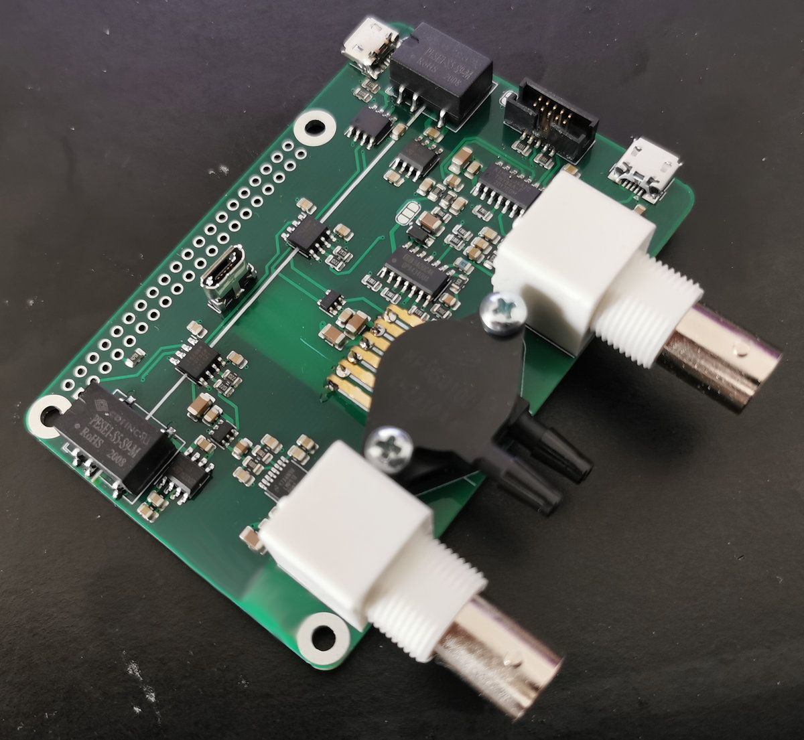
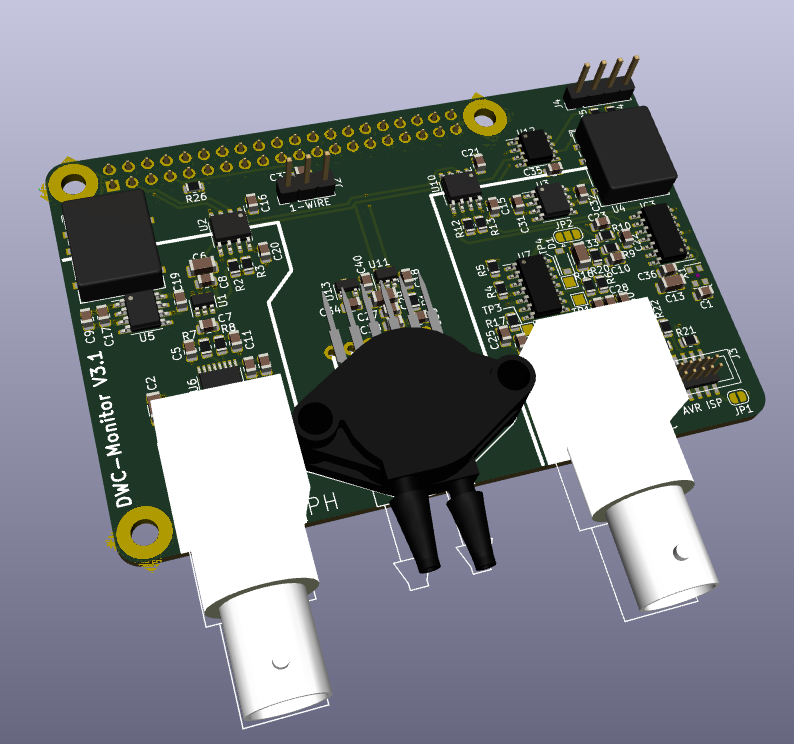

# Rasperry Pi - DWC HAT



Picture above shows V3.0 - New version has some changes (e.g. pinheaders for I2C and 1-wire):



The DWC Hat does following:

- PH measurement (DWC)
- EC measurement (DWC)
- Temperature measurement and correction (DWC)
- Pressure* measurement for water level monitoring (DWC)
- Temperature and humidity measurement of air

*: Everything except the pressure sensing works as expected. It works electrically, but there would be needed a much more sophisticated temperature compensation. To sum it up: It never worked well.

## Raspberry prerequisites

Use `raspi-config` to enable I2C and 1-Wire.

There is a special quirk needed for getting the I2C working properly (because the Pi can't do clock-stretching):

In `/boot/config.txt`:

```
# Uncomment some or all of these to enable the optional hardware interfaces
dtparam=i2c_baudrate=10000
```

It hurts a bit to reduce the I2C rate to 10kHz - but it doesn't really matter :shrug:

Also, the 1-wire pin needs to be configured:
```
# select 1-wire pin
dtoverlay=w1-gpio,gpiopin=4,pullup=on
```


## I2C and 1-wire Devices

There are four I2C and one 1-wire device.

### I2C

```
i2cdetect -y 1:

     0  1  2  3  4  5  6  7  8  9  a  b  c  d  e  f
00:          -- -- -- -- -- -- -- -- -- -- -- -- -- 
10: 10 -- -- -- -- -- -- -- -- -- -- -- -- -- -- -- 
20: -- -- -- -- -- -- -- -- -- -- -- -- -- -- -- -- 
30: -- -- -- -- -- -- -- -- -- -- -- -- -- -- -- -- 
40: 40 -- -- -- -- -- -- -- -- -- -- -- -- 4d -- -- 
50: -- -- -- -- -- -- -- -- -- -- -- -- -- -- -- -- 
60: -- -- -- -- -- -- -- -- -- -- 6a -- -- -- -- -- 
70: -- -- -- -- -- -- -- -- 
```

0x10: EC measurement (fixed by AVR firmware)
0x40: SI7021 temperature and humidity sensor
0x4d: MPX2050DP pressure sensor (ADC MCP3221)
0x6a: PH measurement (ADC MCP3421)

The addresses can differ (e.g. the ADC used in the PH measurement could be either of 0x68 to 0x6f). 

Please check the datasheets of the parts mentioned above and/or `i2cdetect` for the address of your part.

The values are inserted into the `config.ini`:
```
[i2c]
# i2c address of EC measuring (always 0x10)
i2c_ec = 0x10

# i2c address of PH measuring
i2c_ph = 0x6a

# i2c address of MPX2050DP
i2c_pressure = 0x4d

# i2c address of SI7021
i2c_ht = 0x40
```

# 1-Wire

After connecting the 1-wire sensor, there should appear a new device at `/sys/bus/w1/devices/`. 

Add the name to the `config.ini`:

```
[1wire]
ds18b20 = "28-0120625ed8f9"
```

## AVR firmware

The EC-measuring part uses an AVR. Before doing measurements, it needs to be flashed with the firmware.

The ISP connector is 2x10 with 1.27mm pitch. The pinout is compatible to the USBASP.

Also the Makefile expects the USBASP as programmer.

For compilation, you'll need:

```
sudo apt install gcc-avr avrdude avr-libc
```

After that, first initialize the AVR-flags once with:
```
make fuse
```

Afterwards you can compile and flash the AVR with:
```
make
make flash
```

Now, it should be ready to go :slight_smile:


## Calibration

There are two parts that need calibration. (See usage how to get the raw-values).

### PH calibration

PH calibration is done by setting up two reference solutions with PH of 4.01 and 6.86.

After measuring the raw-values, insert them into the `config.ini`:
```
[ph]
# measured PH (raw values)
PH_401 =  13010.0
PH_686 =  2400.0
```


### EC calibration

For calibrating the EC part, two resistors are needed.

They are simply connected to the BNC jack for the EC probe (without the probe) and the raw-values measured by the EC measuring circuit is used for calculating the EC.

The resistors are  390R and 1k.

The values have to be inserted into the `config.ini`:
```
[ec]
# measured EC (raw values)
EC_ADC_390R = 439.0
EC_ADC_1K = 208.0
```

## Usage

By default, the python code does a single measurement and transmitts the date to InfluxDB.

To run it in a loop simply start it in a `screen` session with:
```
 while ((1)); do python3 read.py | tee -a measurements.log ; sleep 1; done

time=1635402997671, ec_raw=243.3764705882353, ec=1345.546146, ph_raw=6772, ph=5.685617, temp=20.875000, pressure_raw=122.5625, pressure_comp=44.20985378262856, humidity=68.68032836914062, airtemp=22.873859863281247
...
```


### Grafana and InfluxDB

Follow any tutorial for installing InfluxDB and Grafana.

Default Database, User, Password is in the `config.ini`.

Make sure to configure the timezone right on the Raspi.

## TODO

There are some things I would like to improve:

- STM32 (M4) for EC measurement. Use internal DAC for DDS sine generation and FIR band pass. This would reduce the parts needed by a lot. Also would improve resolution (12Bit ADC instead of 10Bit ADC).
- Better pt1000 based temperature sensor for DWC. DS18B20 digitizes too coarse what affects temperature compensation of EC negatively.
- Replace the pressure sensing with something else better working. E.g. capacitive sensing with conductive strips glued on the outside of the DWC bin or something else ...

## Disclaimer

Use everything on your own risk!

The project is at it is and if I don't need something else, I won't touch it ever again.

Feel free to do with it whatever you like :slight_smile:

